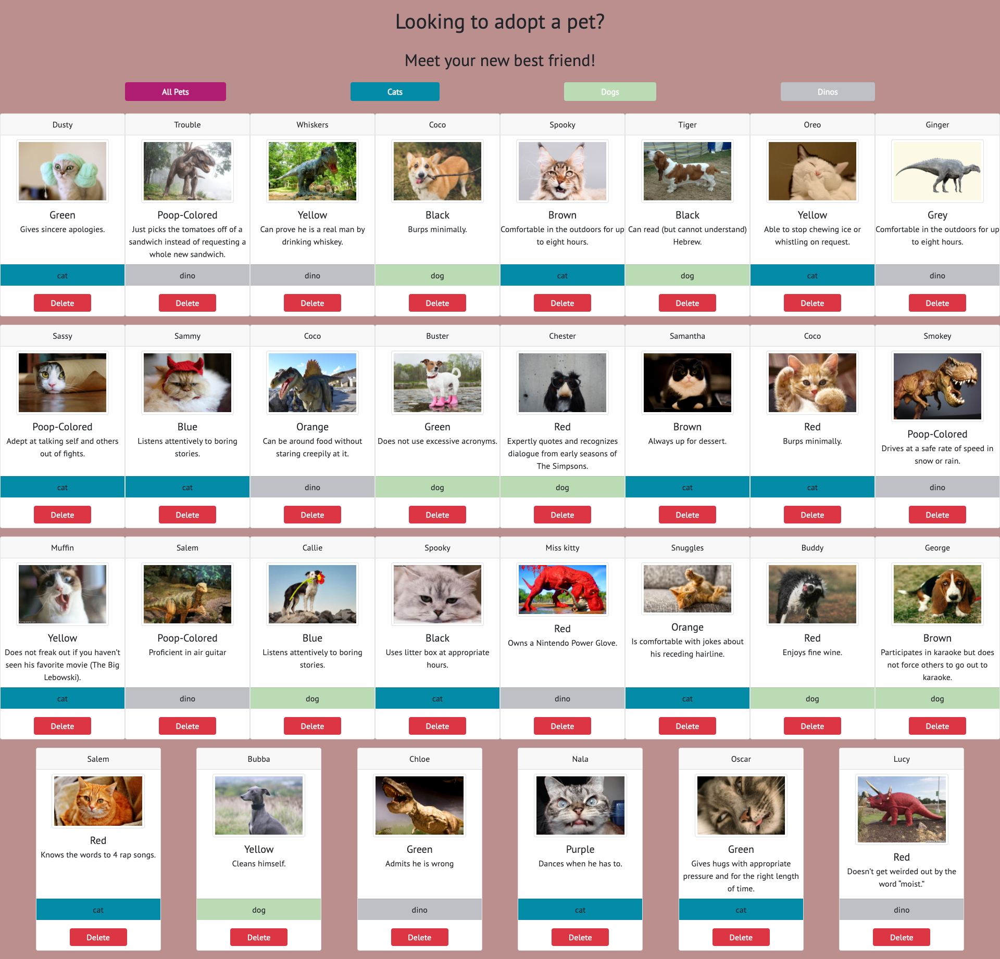
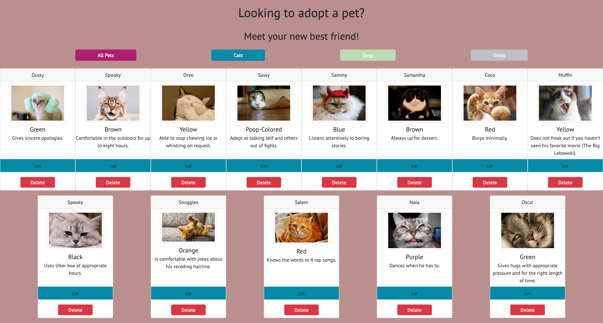

# Pet Adoption App

## Overview
This is an app where the user is able to look at different pets up for adoption. 

## User description
A user that would benefit from this app is one who is looking for pets and wants to be able to filter pets by type to find their new best friend to take home.

## Link to Netlify deployment
https://lindseysatterfield-pet-adoption-app.netlify.app/

## Features
- Dynamically added filter buttons to the DOM that allows the user to filter by pet or all pets
- Delete button dynamically added to delete a pet card

## Screenshots
##### Landing page

##### Filtered by cats

## Loom video
[Pet Adoption walkthrough](https://www.loom.com/share/d266bfe9c40d4b8585bd17f3eb29aefd)

